

# قاموس الـ AI

٢٢ مصطلح لازم تفهمهم في عالم الـ AI، كل مصطلح معاه أيكون بيشرح الفكرة، وشرح بسيط، وفين بيتستخدم في الواقع.

## افتحه أونلاين

🌐 [zahranppc.github.io/ai-dictionary](https://zahranppc.github.io/ai-dictionary/)

## حمّل الملف

📄 [AI-Dictionary-Ahmed-Zahran.pdf](AI-Dictionary-Ahmed-Zahran.pdf)

## المصطلحات

| الأيكون | المصطلح | المعنى |
|:---:|:---|:---|
| 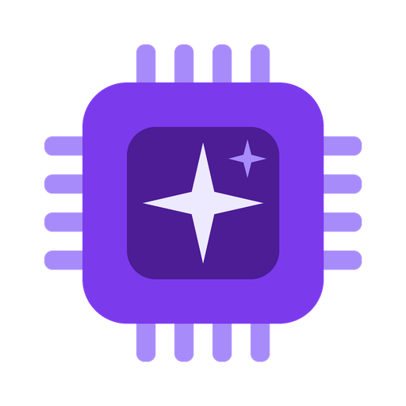 | **AI** | الذكاء الاصطناعي |
| 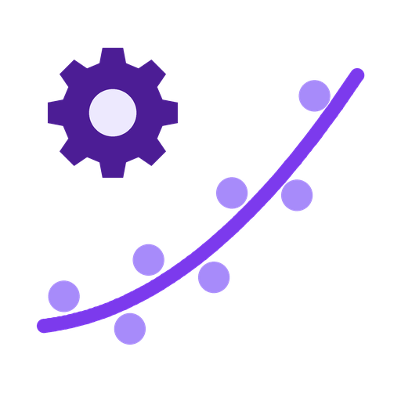 | **Machine Learning** | التعلم الآلي |
| 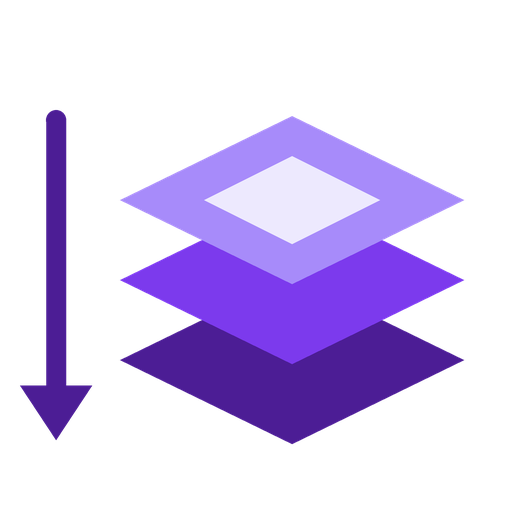 | **Deep Learning** | التعلم العميق |
| 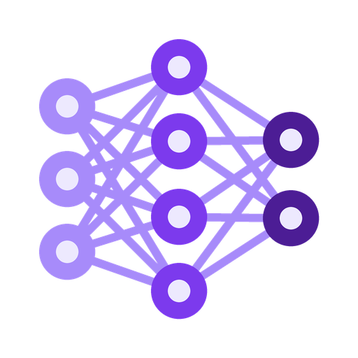 | **Neural Network** | الشبكة العصبية |
| 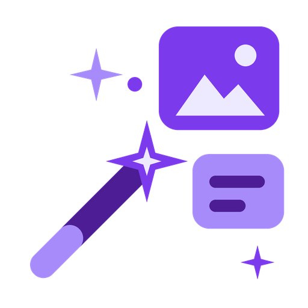 | **Generative AI** | الذكاء الاصطناعي التوليدي |
|  | **LLM** | نموذج لغوي ضخم |
|  | **Multimodal** | متعدد الوسائط |
| 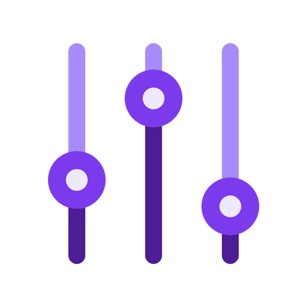 | **Parameters** | المعاملات |
| 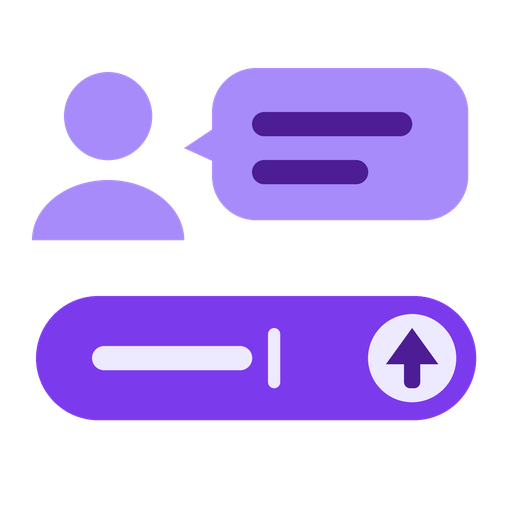 | **Prompt** | البرومبت |
|  | **Prompt Engineering** | هندسة البرومبت |
| 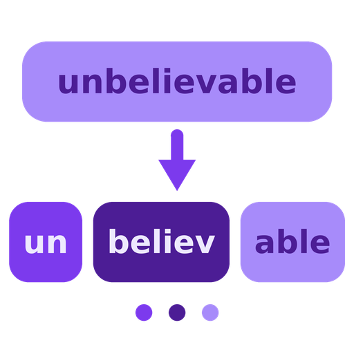 | **Token** | التوكن |
| 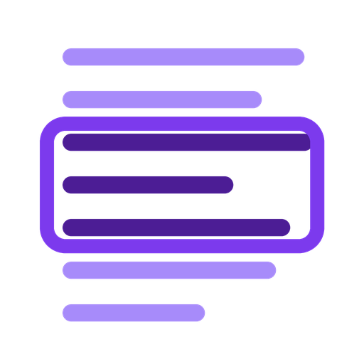 | **Context Window** | نافذة السياق |
| 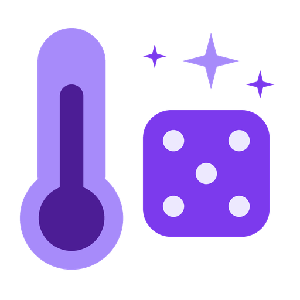 | **Temperature** | درجة الحرارة |
| 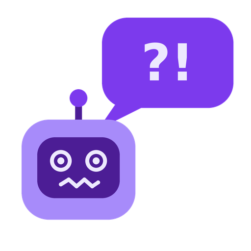 | **Hallucination** | الهلوسة |
| 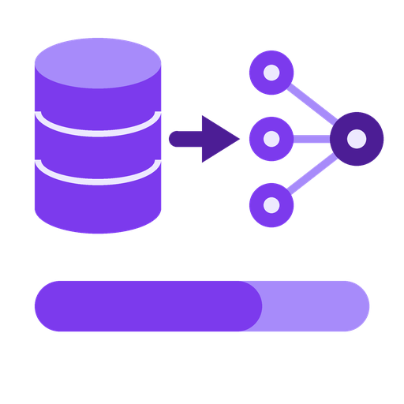 | **Training** | التدريب |
| 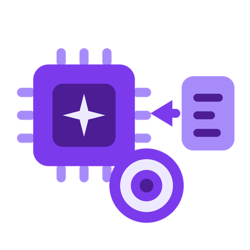 | **Fine-tuning** | الضبط الدقيق |
| 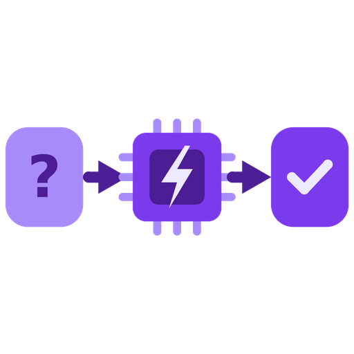 | **Inference** | الاستدلال |
| 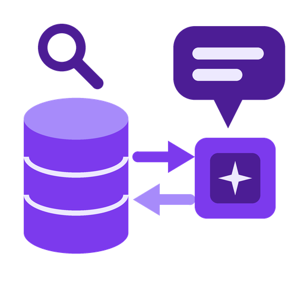 | **RAG** | التوليد المعزز بالاسترجاع |
| 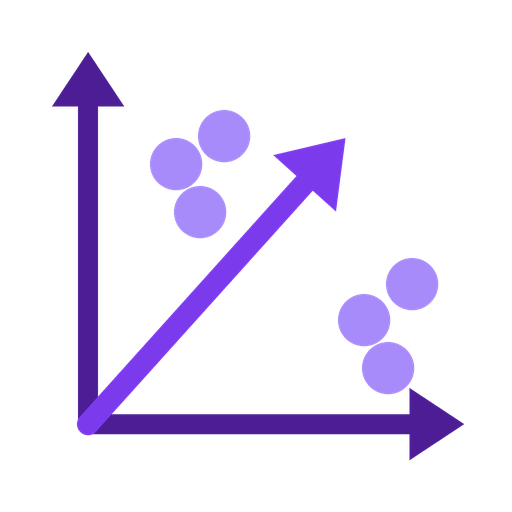 | **Embeddings** | التضمينات |
| 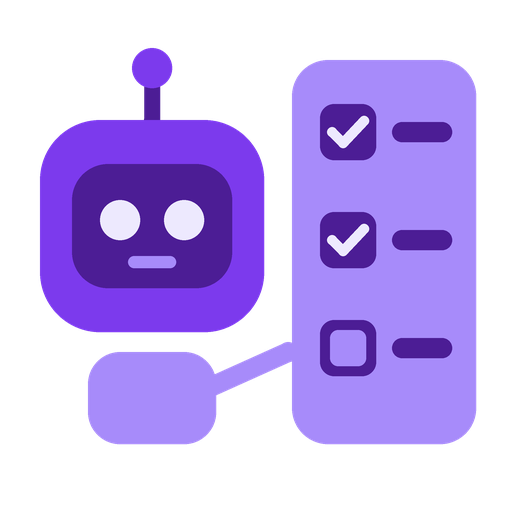 | **AI Agent** | الوكيل الذكي |
| 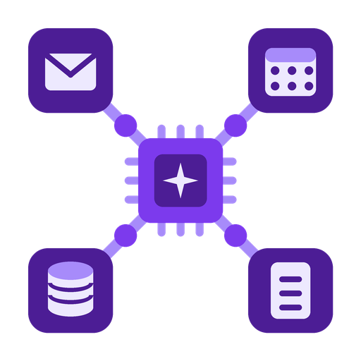 | **MCP** | Model Context Protocol |
|  | **Alignment / Guardrails** | المواءمة والحواجز |

## الأيكونات

كل الأيكونات موجودة في فولدر [`icons`](icons) بصيغة PNG بخلفية شفافة ومقاس 512×512، استخدمها براحتك في المحتوى والبريزنتيشنز.

---

معمول بواسطة **Ahmed Zahran**

